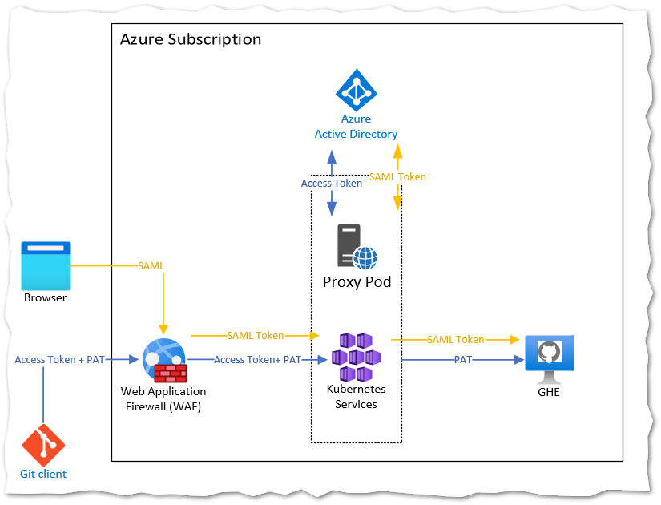
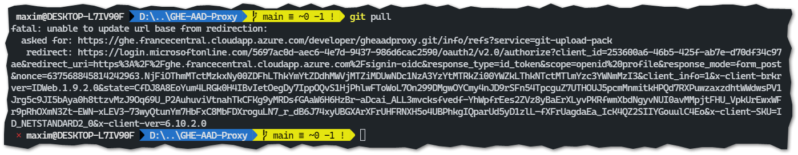
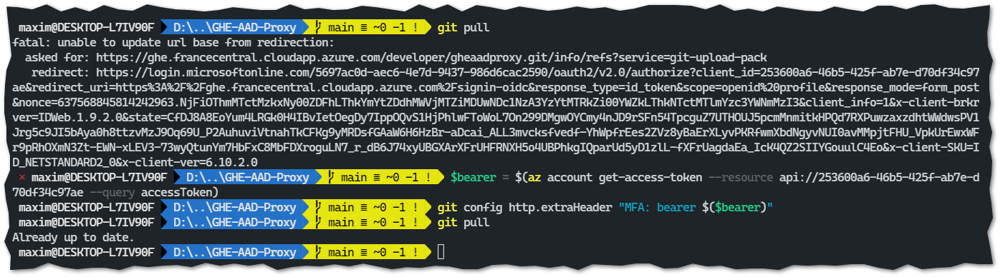
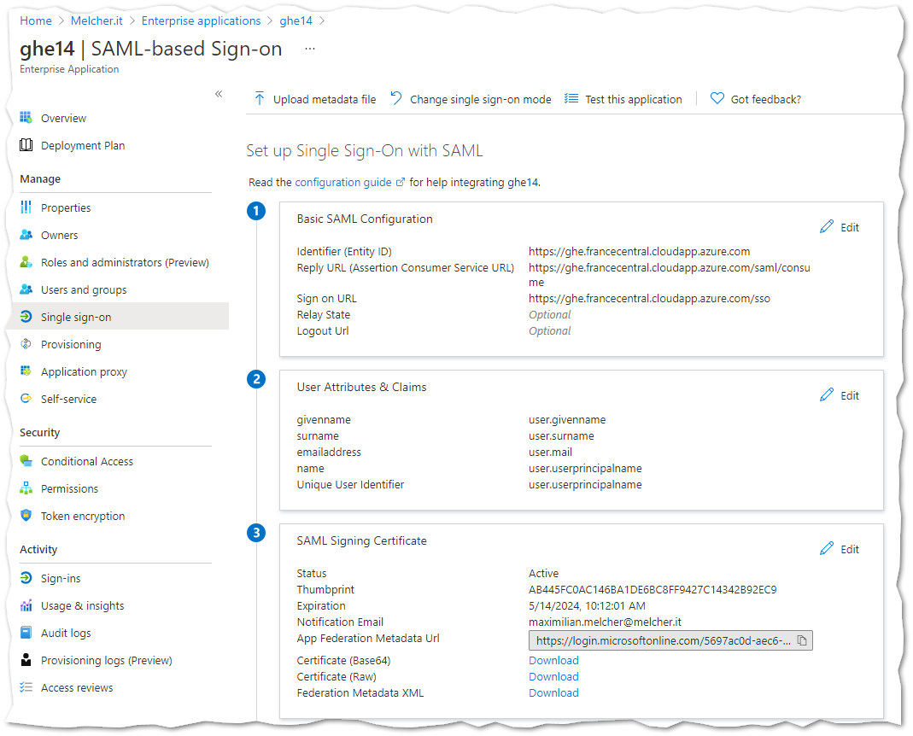
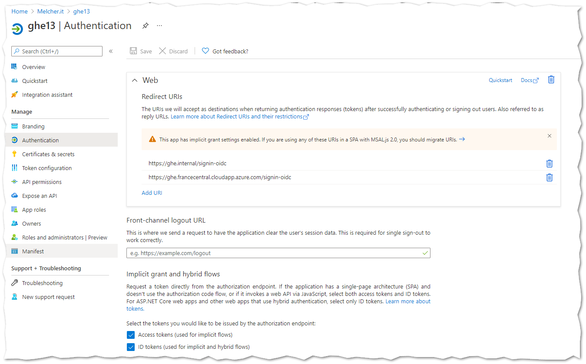
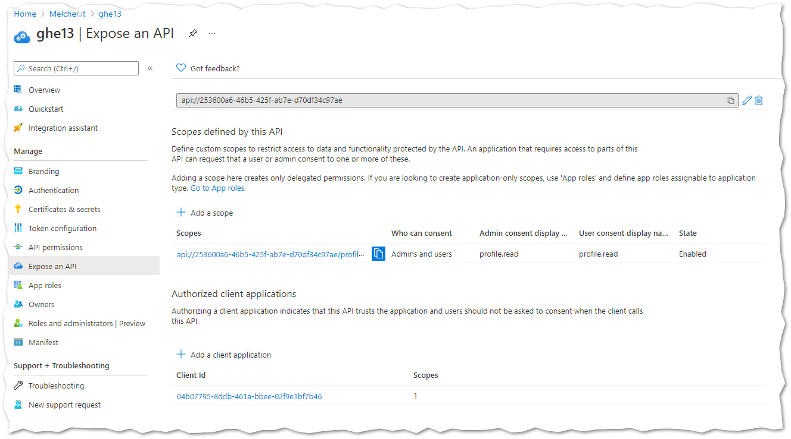

# GitHub Enterprise Server with Azure Active Directory Authentication (GHEAADPROXY)

With GitHub Enterprise Server Version 3.0.6 as self-hosted VM, you can configure SAML authentication backed by Azure Active Directory. 
This protects the web interface, you get conditional access policies with Multi Factor Authentiction powered by Azure Active Directory. 
Sessions do expire after a configurable lifetime, then the user must re-authenticate.

Unfortunately, this does not apply for the git side of things. If you clone a repository, pull or push a username and PAT token or ssh key is being accepted. 
There is no session or multi-factor enforcement. 

With this **proof of concept (PoC)** I want to showcase that it is possible to put a proxy in front of GitHub Enterprise Server that enforces MFA (based on the configuration in Azure Active Directory) and that the session expires.

## High Level Architecture

From left to right we have three components: [Azure Application Gateway](https://docs.microsoft.com/en-us/azure/application-gateway/overview),  [Azure Kubernetes Service](https://docs.microsoft.com/en-us/azure/aks/)(AKS), and lastly GitHub Enterprise Server (GHE) installed in a single VM on Azure. The AKS hosts the authentication proxy container, based on a .NET 5 in Alpine linux (107MB).

The following architecture depicts the two authentication flows.

When a user wants to browse to the web-frontend of GitHub Enterprise (GHE) server, the traffic will be filtered on Azure Application Gateway/ Web Application Firewall (WAF). Afterwards, the traffic will hit the proxy. If there is no AUTHORIZATION bearer header, then the proxy will send a HTTP 302 redirect to Azure Active Directory. The user must sign in and depending on the configuration provide the second factor. Then the request is sent back to the WAF, reaches the proxy and then will be sent unmodified to GHE. 

When a user wants to use the git client, things become more challenging. The client itself is pretty simple on an auth perspective, but provides several options to piggyback additional authorization headers to GHE. The challenge is that GHE does not accept multiple AUTHORIZATION headers, if you provide them it will simply reject the request with a HTTP 400. Additionally the client does not authenticate un-asked. The first request is always unauthenticated, then gets a HTTP 401 by the server, then authenticates with username/password or username/personal access token (PAT).

If the proxy receives an openid connect bearer token, it will validate it. Afterwards it will send the request to GHE without the additional header - multiple or unexpected headers will lead to HTTP 400. 

The following picture shows the git pull experience without a valid bearer token:

The git client does not follow HTTP 302 redirects, no additional authentication will happen.

But it is really simple to get a valid token - the following powershell gets one and puts it in the git config file. This config can be local or global.
It will be submitted to the proxy, stripped from the request and the actual request will go to GHE:

Script to get the token:  
<code>
$bearer = $(az account get-access-token --resource api://253600a6-46b5-425f-ab7e-d70df34c97ae --query accessToken)  
git config --global http.extraHeader "MFA: bearer $($bearer)"
</code>

## Deployment

To deploy this, you need two Azure Active Directory Applications. One Enterprise Application that handles the SAML authentication. The second one is for the openid connect authentication. I tried to combine it, but then only SAML works. 

I started with the SAML authentication for the GHE server - for this you need to register a new Enterprise Application. Only there you can configure the SAML URLs and get the certificate for GHE.

The AAD documentation describes how to [setup SAML with Azure Active Directory](https://docs.microsoft.com/en-us/azure/active-directory/saas-apps/github-tutorial).

The URL https://ghe.francecentral.cloudapp.azure.com points to the frontend IP of the WAF.

The second AAD application is 'only' an Application registration:
 
It has the reply URL set to /signin-openidc and configured Access and ID tokens.

The proxy is using this application, therefore you need the application ID. 
It must be stored in the appsettings.json configuration or as a docker environment variable (AzureAd__ClientId).
Additionally you need to expose an API, this is then needed to generate the access token via azure cli as shown above. The --resource flag points to that API url. The client id 04b07795-8ddb-461a-bbee-02f9e1bf7b46 is the one of Azure CLI: 

## Kubernetes Deployment

I used the [Azure Application Gateway Kubernetes Ingress](https://github.com/Azure/application-gateway-kubernetes-ingress) to manage the WAF directly from the AKS. Additionally I wanted to have [valid SSL certificates provided by LetsEncrypt](https://github.com/Azure/application-gateway-kubernetes-ingress/blob/master/docs/how-tos/lets-encrypt.md).
Once the core infrastructure was running, I deployed the container, a service and ingress as shown in the [deploy.yaml](deploy.yaml).

Some settings are hardcoded in the [appsettings.json](appsettings.json) - they can be overwritten during the kubernetes deployment. 

## OpenSource Components: 
* YARP: Yet Another Reverse Proxy (https://github.com/microsoft/reverse-proxy)
* [Microsoft.Identity.Web](https://github.com/AzureAD/microsoft-identity-web) to handle openid connect, JWT tokens.

## Questions / Feedback

You read so far? Wow - would be happy to get in touch, this is an exotic PoC, let me know if you have questions.

## License and Disclaimer

It is a proof of concept - see [license](license.md).